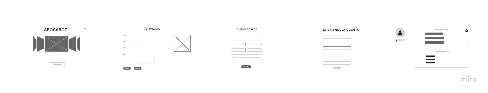

# Abogabot
## Toma de Requerimientos
Se desea implementar una Solución Web para automatizar las demandas de clientes en un despacho de abpgados.

### Requerimientos Funcionales
#### - Administrador:
	1. Implementar un Login para registro de usuarios.
	2. Tener una bases de datos con registros de usuarios.
	3. Recibir notificación cuando ingrese una nueva demanda.
	4. Visualizar los datos llenados del formulario.
	5. Verificar que el pago de transacción ha sido realizada.
	6. Ver la cantidad de ingresos recibidos.
	7. Actualizar el proceso de la demanda.
	8. Agregar comentarios en cada paso del proceso.
	9. Generar informes sobre ingresos de forma semanal y mensual.

#### -  Cliente:
	1. Tener un formulario donde realizar una demanda.
	2. Ver seguimiento del proceso de demanda luego de loguearse.
	3. Recibir notificaciones sobre el avance del proceso.

### Requerimientos no funcionales
	1. El sistema debe ser capaz de operar adecuadamente con hasta 1000 usuarios con sesiones concurrentes.
	2. Se requiere tener una web responsive.
	3. La preferencia de colores será el azul marino y blanco.
	4. Todos los sistemas deben respaldarse cada 24 horas.
	5. El sistema debe ser intuitiva.
	6. El sistema debe proporcionar mensajes de error que sean informativos y orientados a usuario final.

## Diagrama de Flujo

## Buyer Persona:

## Publico Objetivo:

## UI:
[Ver en Miro](https://miro.com/app/board/uXjVPMPPXyU=/?share_link_id=477660938224)

